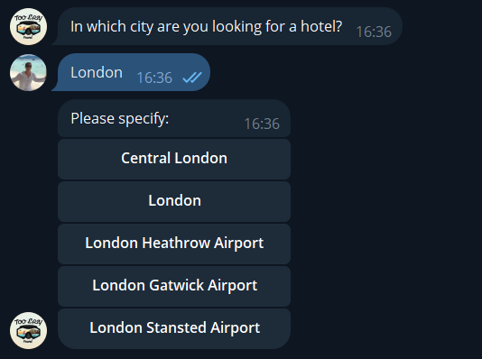
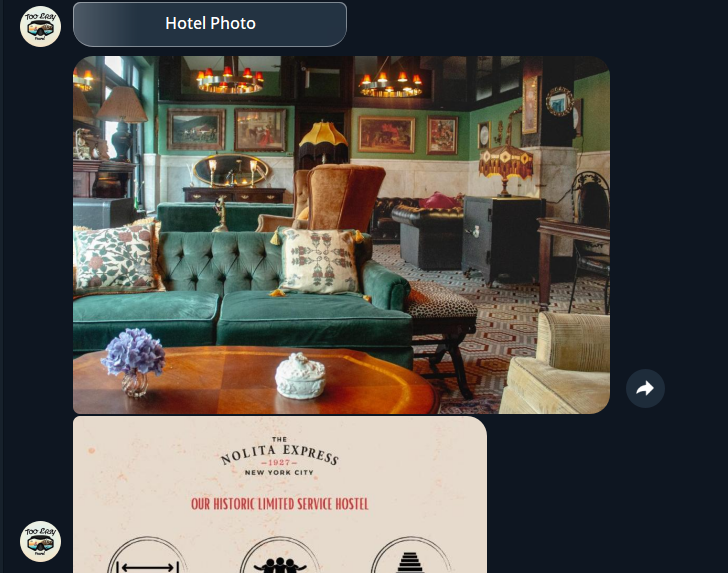

# Too Easy Travel Bot

## Overview
**Too Easy Travel Bot** is a Telegram bot that assists users in finding and booking hotels in various cities. It offers features like displaying the cheapest hotels, the highest-rated ones, and those closest to the city center. Users can also review their search history.

# Installation and First Run Instructions

1. **Clone the project files:**
    ```commandline
    git clone https://github.com/DevAlhemy/TooEasyTravelBot
    ```
    This command will create a `telegramm-bot` folder and save all the required files in it.

2. **Install dependencies:**
    ```commandline
    pip install -r requirements.txt
    ```
    *It is recommended to set up a [virtual environment](https://docs.python.org/3/library/venv.html).*

3. **Obtain an API key:**
    1. Register on [rapidapi.com](https://rapidapi.com)
    2. Subscribe to the [Booking API](https://rapidapi.com/apidojo/api/booking)

4. **Create a new bot and obtain a token:**
    1. In the Telegram app, find the [BotFather](https://t.me/botfather)
    2. Create a new bot using the `/newbot` command
    3. Follow a few simple steps  
    [Guide](https://core.telegram.org/bots#6-botfather) 

5. **Rename the `.env.template` file to `.env`, and specify your bot token and Booking API key in it.**  
    Example of `.env` file:
    ```dotenv
    BOT_TOKEN='5552863856:AAGgZR8MfEeFw6QmyOb7OTUGe----------'
    API_KEY='e3a9922fdfmsh8124132fae4ffbdp1b7e1bjsnd9----------'
    ```

6. **Run the program:**
    ```commandline
    python main.py
    ```

## Key Features
1. **Lowprice**: Shows the most affordable hotels in the selected city.
2. **Bestdeal**: Displays hotels closest to the city center with the best rates.
3. **Top Rated**: Lists the highest-rated hotels in the selected city.
4. **History**: Allows users to review their past hotel search history.


## Using the Bot
1. Start a conversation with the bot to receive a welcome message.  
   

2. Type `/help` to see the available commands.  
   

3. Choose the city where you'd like to search for hotels.  
   

4. Select your arrival and departure dates.  
     
   

5. Specify the number of hotels to display.  
   
   
6. The bot will present hotel options based on your criteria.  
   

7. Review your search history by selecting the "History" option.  
   

8. Tap on a history button to repeat a previous search.  
   

9. Open the hotel’s booking page on Booking.com directly from the bot.  
   

10. View images of the hotels, including exterior and room photos, to help with your decision.  
    

## Conclusion
**Too Easy Travel Bot** simplifies the process of finding and booking hotels. With features like filtering by price, rating, and location, as well as the ability to review search history, users can easily find the best options for their next trip.
